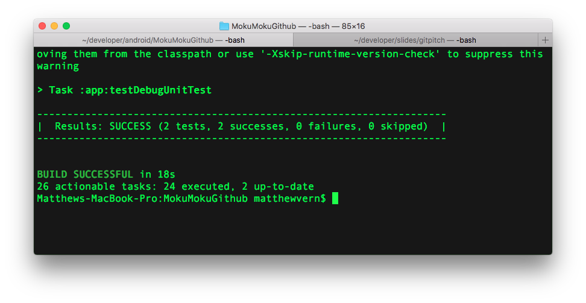
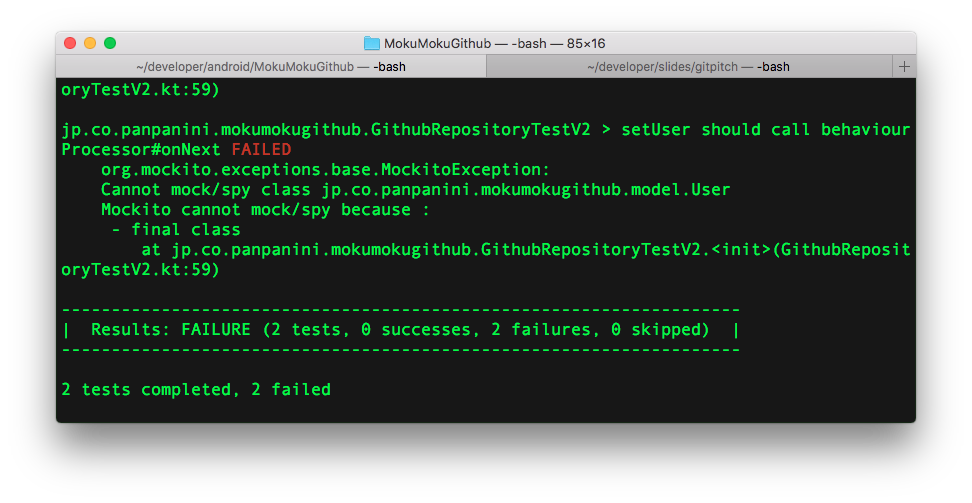
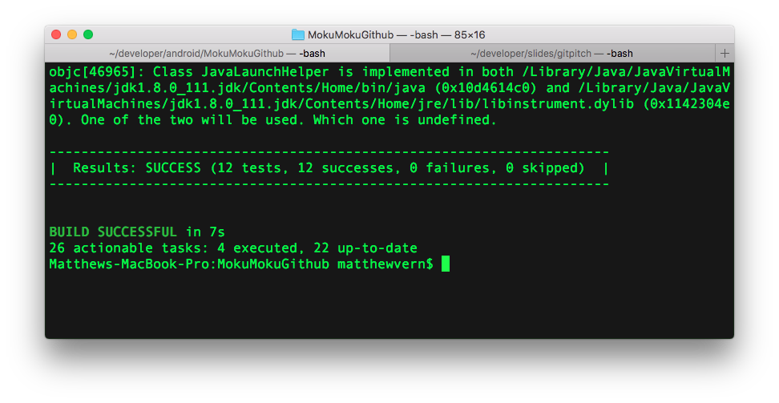
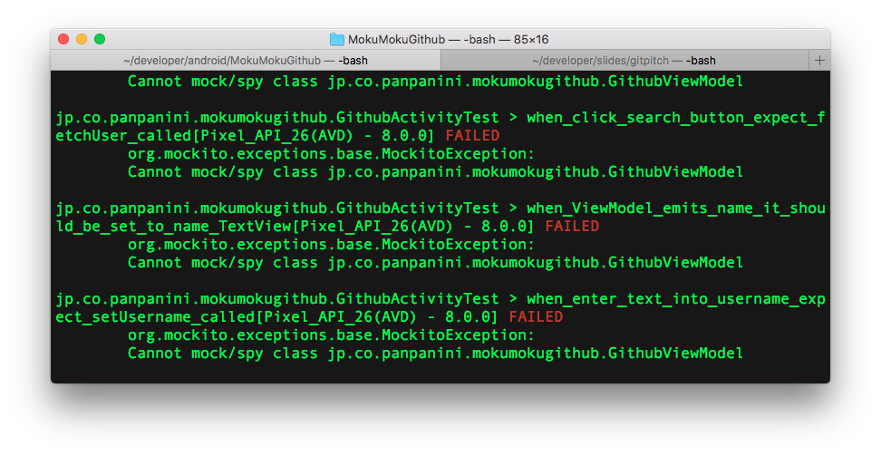
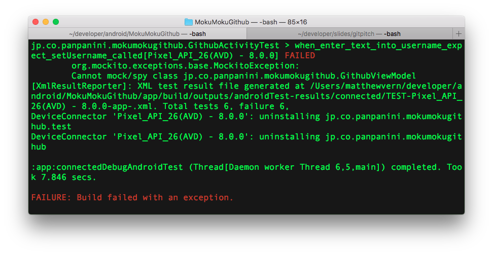
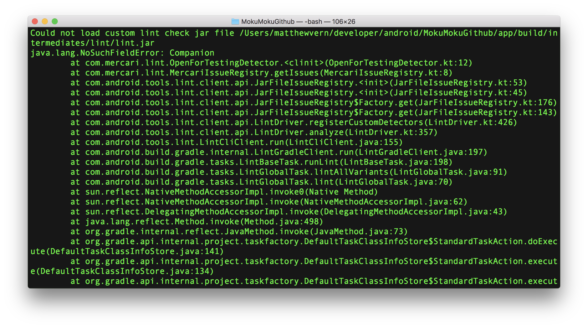

---?image=assets/image/title-background.png

## Kotlinをテストするの楽しさを味わってみよう

### Osaka Mix Leap Study #11

---
<p><span class="slide-title">About me</span></p>


- Matthew Vern / Panini
- Twitter [@callipan]()
- Github panpanini
- Mercari, Inc
- Android Engineer (US)
- Kotlin可愛い
- [kotlin@kawaii.com]() |

Note: 自己紹介
最近アプリ作ろうって思って、こんなん出来ましたーすごいでしょー？Githubのユーザーを検索するといろんな情報表示してくれる便利なアプリですよ！

---


---


Note:
Google Playにリリースしたいけど、バグったらすんごく怖そうなレビュー来そうなので、防ぐためTest書こうと思いました！アプリはもちろんKotlinで書いてあるよ！なぜかと言うと

---
<!-- Kotlin -->
<!-- TODO: add spacing here (or header?) -->
## Kotlin

- Works on JVM
- Strongly typed language
- Type inference
- Better Java |

Note:
ScalaみたいにJVMで動くので簡単にJavaの代わりに使えます。
JVM言語の１つ
型付き言語
型推論
Better Java

---
## Kotlin - language decisions

- Designed with safety in mind
- Null safety
- if & when are expressions, not statements
- Classes & methods are final by default

Note:
Kotlin作ったJetBrains社が「安全と使いやすさ」を目標にしていろんな便利な言語フィーチャー付いてますと！ヌル安全はもちろんですが、if式とwhen式は戻りちを返せるので、より分かりやすく書けるのでそごく便利な言語である。あと、クラスやメソッドはでファルトjavaのfinal classになってるので、openと言うキーワード付けないと継承(けいしょう)出来ないで、これだけで大分変な動きを防げるし、変な設計もなりにくくなります。

と言っても、やっぱテスト書かなあかんですが、その前はTestable code書かないとどうもなりません。

---
## Testable code

- Writing code that is easy to test
- SOLID
  - Single Responsibility

Note:
Testable codeは「テストしやすいコード」のことです。実際にテスト書かなくても、テストしやすいコードさえ書けば、大分分かりやすいコードを書いてしまうことになります。Javaではよく「SOLID」って言うんですが、自分はそのSingle Responsibility(単一責任の原則たんいつ　せきにん　の　げんそく)のSが一番大事だと思っております。ちゃんと責任を管理出来ると後は楽になります。

---
## Layered architecture
<!-- TODO -->
- 4 layers to my app
- View |
- ViewModel |
- Service |
- Repository |

Note:
このアプリ大きく分けてレイヤー4つあります。MVVM慣れてるからViewとViewModelがあって、次はServiceと呼ばれてるけれどそこbusiness logicとか、API叩いてるコードが組んでて、で最後はRepository.Repositoryにデータを管理していまる。

---


Note:
もうちょっと詳しく知りたい方にはこの本をオススメします、すごく分かりやすくアプリの設計の説明書いてあるます。

---
## Unit tests
Start with Repository
- Just in charge of storing/returning data

Note:
よし！テスト書くぞ！まずRepositoryから始めましょう！Repositoryはただデータの管理してるからテスト書きやすいはず！
---?code=src/main/GithubRepository.kt&lang=kotlin&title=GithubRepository.kt
@[2](Data stored on memory in BehaviorProcessor)
@[5-8](Flux-like separation of actions & reactions)
@[10](Return Flowable data)
Note:
コードはこんな感じで、データはon memoryで保存しちゃってるけどSqlite使ってもそんなに変わらないです。Fluxみたいにactionとreactionは分けて、unidirectional dataflow的な設計を目指している。で、RxJava使ってFlowableを介してる。ほな、テスト書こう！

---
# 🤔
## What should we test?

Note:
というっても、一体何テストすれば良いの

---
## Test expectations.
- Expect repository to: |
- Store data |
- Return data |
  - Return stored data |

Note:
テストは「期待してる動きを確認する」なので、そうしよう。Repositoryはデータ管理してるからちゃんと保存出来たり、渡してくれたりしてるならオッケー！

---?code=src/test/GithubRepositoryTest.kt&lang=kotlin&title=GithubRepositoryTest.kt
@[2](Target to test)
@[3](Data to return)
@[6-10](Expect we can store data)
@[13-22](Expect we can get stored data)

Note:
で、こんな感じに出来上がる！targetはテストしたいクラス。期待してる戻り値のobjectを定義して、ちゃんとデータを保存出来るか確認する。それで、次は保存したデータはちゃんと返ってくるか確認する。

---
## Lets Run it!

---



---
## It works!
- But... |
- Are we really testing anything? |
- We're reliant on the implementation of BehaviorProcessor |

Note:
よしゃ！！テスト書いたぞ！
ん。。やけど、、期待してる動き確認したって微妙
そしてBehaviorProcessor依存しちゃてる..

---
## Lets write a better test using mocks.
- Mocks allow us to: |
  - abstract away unrelated behavior |
  - verify correct behavior |
Note:
依存してるクラスをモックすると、自分らが書いたコードだけをテストできる。で、依存されてるクラスのメソッドはちゃんと呼ばれてるか確認出来る

---?code=src/test/GithubRepositoryTestV2.kt&lang=kotlin&title=GithubRepositoryTestV2.kt
@[2](Target is the same)
@[4-5](Create mocks for classes we aren't testing)
@[7-10](Pass mock to target before each test)
@[13-19]()
@[18](Check that the correct method is called, with the correct parameter)
@[22-30]()
@[23-24](abstract away BehaviorProcessor)

Note:
targetは変わらないけれど、
依存してるクラスをモックして、
targetに渡す！
んで、テストでちゃんと呼ばれるはずメソッドが呼ばれてるか確認し、
BehaviorProcessorの動きをテストせず、自分らが書いたコードだけをテストしよ。

---
# Lets run it!
Note:
よし！行こう！

---


---
# 🙀
- errors?? |
- can't mock final class? |

Note:
Failureだと？
Exception?
final classモック出来ない？？
あ、、、

---
## Kotlin

- Final by default

Note:
Kotlinのクラスopenしないと継承出来ないね

---
# 😇
<br />

---
# 🤔
## How can we subclass a final class?

---
# MockMaker
- Black magic |


Note:
Mokitoが作ってるinline mock maker使うと、何となくうまく行くはず。
仕組みは謎です。

---

```
echo 'mock-maker-inline' >
  app/resources/mockito-extensions/org.mockito.plugins.MockMaker
```

Note:
このファイルさえ作れば、テストは通るよ。謎です
よす、試してみよ！

---


Note:
とおた！次はService

---?code=src/main/GithubService.kt&lang=kotlin&title=GithubService.kt
@[6-9](fetchUser() calls API and repository)
@[11-13](observeUser() calls repository)

Note:
Serviceもメソッド２つしかないから割とテストしやすいほう。
ここでAPI叩いて、
ここでRepositoryが持ってるモデルを返すと。

---?code=src/test/GithubServiceTest.kt&lang=kotlin&title=GithubServiceTest.kt
@[2, 10-12](Target)
@[4-5](Mocks)
@[15-26](Test fetching user)
@[29-37](Test returning user)

Note:
Repositoryと結構似てて、
ターゲットあって、
依存してるクラスをモックして、
fetchでAPI叩くか確認して、
Repository持ってるモデル返してるか確認して終わり！んで〜

---


Note:
よし！次！


---?code=src/main/GithubViewModel.kt&lang=kotlin&title=GithubViewModel.kt

@[5-6](Name)
@[8-9](Location)
@[11-12](Repository count)
@[14-16](Repository button visibility)
@[19-20](Profile image URL)
@[22-25](User input)
@[27-29](Request user)

Note:
ViewModelレイヤーで一気にメソッド数が上がりますね。View側でモデルの依存させたくないからこうやって、取りたいデータをモデルから分けて渡します。
で、ここはuser inputを取得して、View死んでもちゃんと持ってるようにする。
これも割とテストしやすい、モデルの中のpropertyをFlowableとして出してるだけなので

---?code=src/test/GithubViewModelTest.kt&lang=kotlin&title=GithubViewModelTest.kt

@[2](Target)
@[4-9](Mocks)
@[16-25](Test)

Note:
先のテストとほぼ同じなので全部見なくていいよね？よし、テストするぞ！

---



Note:
やった！これでほぼほぼカバレージ上がってる！最後はビュー！

---?code=src/main/GithubActivity.kt&lang=kotlin&title=GithubActivity.kt
@[48-80]()

Note:
ま、普通のActivityです、View持っててViewModelバインドしてるだけですね。
今までのクラスViewModelなどはAndroidのAPIいっさいに使ってないから普通のJVMでテスト出来てるけどActivityをテストするにはそう簡単に出来ない

---
## Instrumentation Tests
- Can't use Android API in unit tests
- Use Instrumentation tests instead

Note:
Unit TestではAndroidのSDKモックされています、なのでぜんAPIからヌルは返ってくる。これじゃテスト出来ないので、Instrumentation Test使って、端末、またはemulator上でテスト走らせる。

---?code=src/instrumentationTest/GithubActivityTest.kt&lang=kotlin&title=GithubActivityTest.kt


Note:
これもViewModelみたいに同じようなテストを何回も書いてるから一個だけ見せます。
ま、こんな感んじにテストする。

---
# Lets run it!

Note:
よし！行け！

---


Note:
あれ

---

# 🙀
- runtime errors??
- can't mock final class?
- 🤔 we saw this before right?

Note:
エラーか、、ってかなんか見覚えがあるな、このエラー

---
## MockMaker

Note:
そっか！Instrumentation Testは別ディレクトリなのでMock Maker設定し直さないとってこと。よし、これで行ける

---



---

# 🤔
- なぬ？？

---
# 😇
- MockMaker doesn't work on Android JVM |
- Use kotlin-all-open plugin instead |

Note:
Mock MakerはDalvikJVM上じゃ動かないらしいー
でも問題はクラスはfinalになって、継承出来ないです。なので、クラスをopenにすると行けるはず。クラス１つ１つopenにするのはちょっとめんどくさいので
all-openのpluginを使いましょう

---
## all-open plugin
- makes kotlin classes & methods `open` by default
- can set an annotation to only open certain classes
- Then those classes will no longer be final

Note:
all-openとは公式のpluginで、全クラスをopenにしてくれる。
で、annotationに付けるとannotationされてるクラスだけはopenになる！

---
## all-open plugin

- create `@OpenForTesting` annotation
- annotate ViewModel
- Lets run it!! |

Note:
では、まずは OpenForTesting annotationを定義して、
ViewModelに付けて、
テスト走らせよう！


---


# 🎉
<br />

---

# 🤔
<br />

Note:
テスト動いてるけど、ViewModelはopenになっちゃって、誰でも継承出来てしまう。

---

## Lets fix it with Lint

Note:
Lintで解決しよ。

---
## Lint?
- Static analysis tool
- Finds possible errors in your code
- Multiple warning levels (Info, Warning, Error)

Note:
Lintはプログラムの動きをテストするんじゃなくて、実際に書いてあるコードをテストして、宜しくなさそうなところ見つかったら教えてくれる神ツールである。
Lintを使うと、将来に誰かがViewModelを継承しようとすると怒られるようにしましょう。

---
## Lint tasks
- Check each classes superclass
- Check the superclasses annotations
- If we find the `@OpenForTesting` annotation
- Show error

Note:
仕組みはこう：
あるクラスの親クラスをとって、
その親クラスのannotationをみて、
`@OpenForTesting` のannotation付いてたら
突っ込む

---?code=src/lint/OpenForTestingDetector.kt&lang=kotlin&title=OpenForTestingDetector.kt
@[35-37](Check superclass annotations)
@[40-45](Report issue)

Note:
いっぱい書いてあるけど見るべきところはここぐらいかな
親クラスのannotationをみて `@OpenForTesting` 入ってたら
レポートする！

---?code=src/lint/OpenForTestingDetectorTest.kt&lang=kotlin&title=OpenForTestingDetectorTest.kt

Note:
んでもちろんLintもテストするぞ！
Lintテストするには期待してるエラーがちゃんと出てるか確認する

---
# Lets run it!

---


Note:
マジかよー

---

# 😭
- Kotlin Lint isn't supported by gradle plugin 3.0

Note:
Gradle plugin 3.0じゃ対応してない...
もう、いいか？やめよっか？
疲れてるからTwitterでもみよ

---


Note:
ん？何だと？
AndroidStudio3.1以上じゃ動くと？
DEMO

---
## Summary
- Kotlin is a safe language
- Sometimes too safe 😇
- MockMaker 💯
- Lint is useful

---
## Appendix
- Architecture Patterns
  - https://peaks.cc/tsuyogoro/architecture_patterns
- How to make Custom Lint - kgmyshin
  - https://speakerdeck.com/kgmyshin/how-to-make-custom-lint-at-shibuya-apk-24
- Github + Slides
  - https://github.com/panpanini/FunTestingGithub
