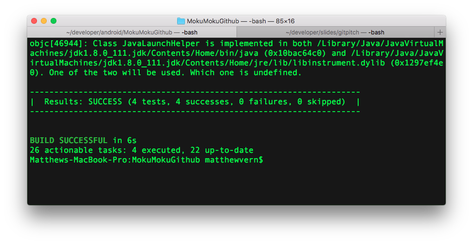

---?image=assets/image/title-background.png

## Kotlinをテストするの楽しさを味わってみよう

### Osaka Mix Leap Study #11

---
<p><span class="slide-title">About me</span></p>


- Matthew Vern / Panini
- Twitter [@callipan]()
- Github panpanini
- Mercari, Inc
- Android Engineer (US)
- Kotlin可愛い
- [kotlin@kawaii.com]() |


---


---


---
<!-- Kotlin -->
<!-- TODO: add spacing here (or header?) -->
## Kotlin

- Works on JVM
- Strongly typed language
- Type inference
- Better Java |


---
## Kotlin - language decisions

- Designed with safety in mind
- Null safety
- if & when are expressions, not statements
- Classes & methods are final by default

---
## Testable code

- Writing code that is easy to test
- SOLID
  - Single Responsibility

---
## Layered architecture
<!-- TODO -->
- 4 layers to my app
- View |
- ViewModel |
- Service |
- Repository |

---


---
## Unit tests
Start with Repository
- Just in charge of storing/returning data

---?code=src/main/GithubRepository.kt&lang=kotlin&title=GithubRepository.kt
@[2](Data stored on memory in BehaviorProcessor)
@[5-8](Flux-like separation of actions & reactions)
@[10](Return Flowable data)

---
# 🤔
## What should we test?

---
## Test expectations.
- Expect repository to: |
- Store data |
- Return data |
  - Return stored data |


---?code=src/test/GithubRepositoryTest.kt&lang=kotlin&title=GithubRepositoryTest.kt
@[2](Target to test)
@[3](Data to return)
@[6-10](Expect we can store data)
@[13-22](Expect we can get stored data)


---
## Lets Run it!

---


---
## It works!
- But... |
- Are we really testing anything? |
- We're reliant on the implementation of BehaviorProcessor |


---
## Lets write a better test using mocks.
- Mocks allow us to: |
  - abstract away unrelated behavior |
  - verify correct behavior |

---?code=src/test/GithubRepositoryTestV2.kt&lang=kotlin&title=GithubRepositoryTestV2.kt
@[2](Target is the same)
@[4-5](Create mocks for classes we aren't testing)
@[7-10](Pass mock to target before each test)
@[13-19]()
@[18](Check that the correct method is called, with the correct parameter)
@[22-30]()
@[23-24](abstract away BehaviorProcessor)

---
# Lets run it!


---


---
# 🙀
- errors?? |
- can't mock final class? |


---
## Kotlin

- Final by default

---
# 😇
<br />

---
# 🤔
## How can we subclass a final class?

---
# MockMaker
- Black magic |

---

```
echo 'mock-maker-inline' >
  app/resources/mockito-extensions/org.mockito.plugins.MockMaker
```

---


---?code=src/main/GithubService.kt&lang=kotlin&title=GithubService.kt
@[6-9](fetchUser() calls API and repository)
@[11-13](observeUser() calls repository)


---?code=src/test/GithubServiceTest.kt&lang=kotlin&title=GithubServiceTest.kt
@[2, 10-12](Target)
@[4-5](Mocks)
@[15-26](Test fetching user)
@[29-37](Test returning user)

---



---?code=src/main/GithubViewModel.kt&lang=kotlin&title=GithubViewModel.kt

@[5-6](Name)
@[8-9](Location)
@[11-12](Repository count)
@[14-16](Repository button visibility)
@[19-20](Profile image URL)
@[22-25](User input)
@[27-29](Request user)


---?code=src/test/GithubViewModelTest.kt&lang=kotlin&title=GithubViewModelTest.kt

@[2](Target)
@[4-9](Mocks)
@[16-25](Test)


---


---?code=src/main/GithubActivity.kt&lang=kotlin&title=GithubActivity.kt
@[48-80]()


---
## Instrumentation Tests
- Can't use Android API in unit tests
- Use Instrumentation tests instead


---?code=src/instrumentationTest/GithubActivityTest.kt&lang=kotlin&title=GithubActivityTest.kt


---
# Lets run it!


---


---

# 🙀
- runtime errors??
- can't mock final class?
- 🤔 we saw this before right?


---
## MockMaker


---


---

# 🤔
- なぬ？？

---
# 😇
- MockMaker doesn't work on Android JVM |
- Use kotlin-all-open plugin instead |


---
## all-open plugin
- makes kotlin classes & methods `open` by default
- can set an annotation to only open certain classes
- Then those classes will no longer be final

---
## all-open plugin

- create `@OpenForTesting` annotation
- annotate ViewModel
- Lets run it!! |


---


# 🎉
<br />

---

# 🤔
<br />


---

## Lets fix it with Lint


---
## Lint?
- Static analysis tool
- Finds possible errors in your code
- Multiple warning levels (Info, Warning, Error)


---
## Lint tasks
- Check each classes superclass
- Check the superclasses annotations
- If we find the `@OpenForTesting` annotation
- Show error


---?code=src/lint/OpenForTestingDetector.kt&lang=kotlin&title=OpenForTestingDetector.kt
@[35-37](Check superclass annotations)
@[40-45](Report issue)


---?code=src/lint/OpenForTestingDetectorTest.kt&lang=kotlin&title=OpenForTestingDetectorTest.kt


---
# Lets run it!

---


---

# 😭
- Kotlin Lint isn't supported by gradle plugin 3.0


---


---
## Summary
- Kotlin is a safe language
- Sometimes too safe 😇
- MockMaker 💯
- Lint is useful

---
## Appendix
- Architecture Patterns
  - https://peaks.cc/tsuyogoro/architecture_patterns
- How to make Custom Lint - kgmyshin
  - https://speakerdeck.com/kgmyshin/how-to-make-custom-lint-at-shibuya-apk-24
- Github + Slides
  - https://github.com/panpanini/FunTestingGithub
